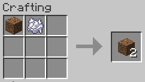
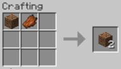
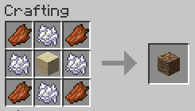
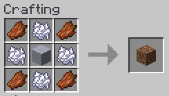

# Minecraft Fabric DirtCheap Mod

Dirt must be dirt cheap. But in Minecraft cobblestone is cheaper than dirt, because it is free.

Although there are complicated ways to create dirt from cobblestone, I do not like them. 
So I made this mod to make dirt really cheap by adding a few recipes that allow duplication
of dirt blocks by mixing them with cheap, easily renewable items. 

 

Since V1.1.0 there are two more recipes to create dirt from sand and clay.

 

## License

Standard MIT license. Feel free to learn from it and incorporate it in your own projects.

## Source code

Available on [GitLab](https://gitlab.com/pintergabor/dirtcheap.git) or on [GitHub](https://github.com/pinter-gabor-at/dirtcheap.git).

## For developers

Quite often, when I start learning programming on a new platform, I find even the simplest examples too complicated.
Tutorials, written by experts, with years of experience programming on that platform, sometimes forget how difficult those first step are.
This is why I decided to make my first, very simple, Minecraft mods publicly available.

This mod is probably the simplest possible which adds something usable to Minecraft. The source code is short, and fully documented. It is a good starting point for anyone new to modding.  
